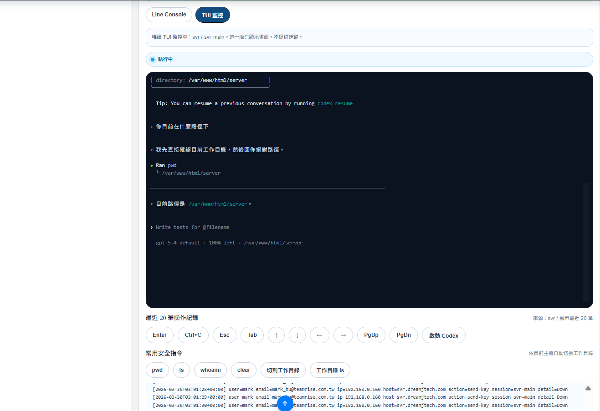
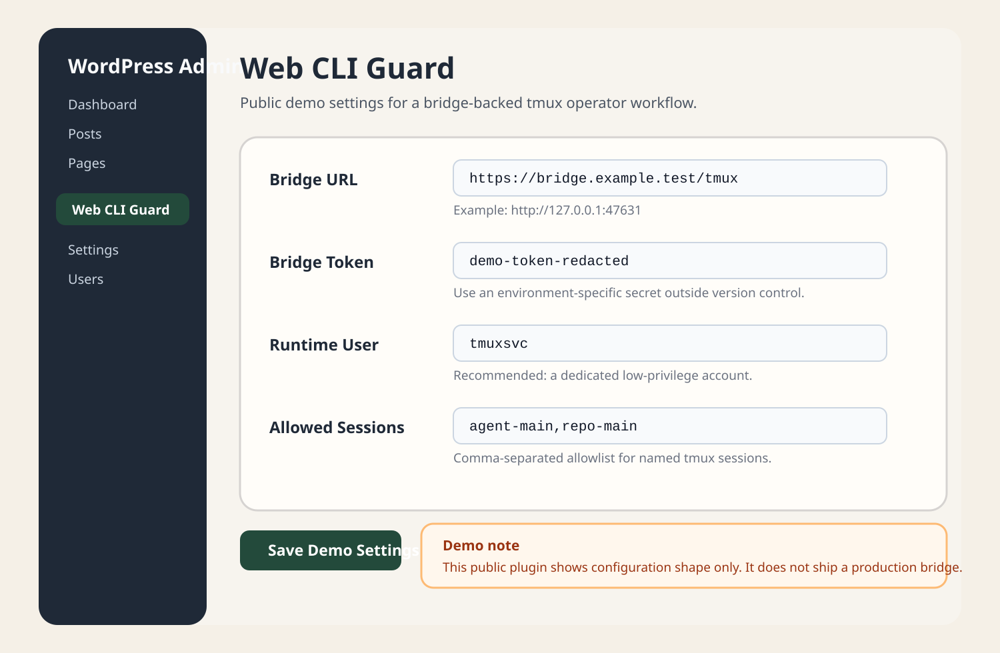
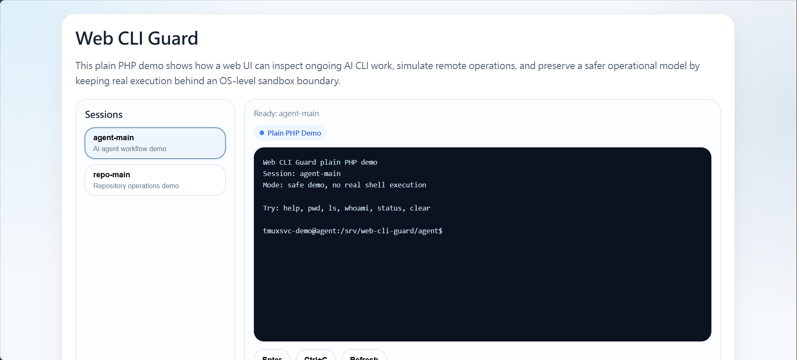
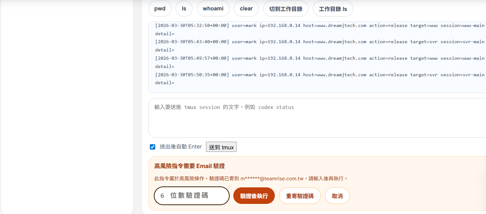

# Web CLI Guard

English | [繁體中文](./README.zh-TW.md)

Web CLI Guard is a small open-source starter for putting existing CLI tools behind a controlled web interface.

It is meant for teams that want to view or operate an existing AI CLI workflow from the web without exposing a raw unrestricted shell.

It is built around a practical pattern:

- `tmux` for persistent sessions
- a low-privilege Linux user for the real runtime boundary
- a narrow bridge for `list / capture / send`
- audit logs and session locking
- OTP or approval for elevated commands
- an optional WordPress-based operator UI

## Why This Exists

A lot of teams already use CLI-native tools such as:

- `codex`
- `claude`
- local shell assistants
- repo-specific scripts

The difficult part is not the CLI itself. The difficult part is giving people a usable web entrypoint without falling back to a raw unrestricted web terminal.

Done well, this pattern lets operators:

- inspect current AI CLI work from the web
- check what an AI agent is currently doing while away from the server
- review ongoing session output without SSH
- perform limited remote actions from a browser with approval gates
- use a safer remote-operations surface than a generic web shell
- rely on OS-level least privilege and sandbox boundaries
- add approval or OTP before elevated actions

This project documents one opinionated approach:

1. run the CLI inside a dedicated `tmux` session
2. run that session as a restricted OS user
3. expose only a narrow web bridge
4. add audit logs and per-session locking
5. require extra verification for elevated commands

## About

Web CLI Guard is best understood as a controlled operator window into an existing CLI runtime.

It can be useful when you want to:

- watch an ongoing `codex`, `claude`, or shell-based AI session from outside the office
- let staff review current output and send a few allowed commands without direct SSH access
- keep long-running AI work inside a persistent `tmux` session while exposing only a narrow browser control surface
- add step-up verification before sensitive actions such as service restarts or privileged maintenance tasks
- combine web authentication, operator audit trails, and OS-level sandboxing into one workflow

The core idea is simple:

- the browser is for visibility and controlled input
- the OS account or sandbox is the real execution boundary
- elevated actions should require extra verification, not blind trust in the UI

## Scope

This repository is a starter, not a finished product.

Included today:

- architecture and security docs
- a minimal bridge API contract
- a minimal Python bridge
- a minimal Node.js bridge
- example `systemd` units
- example helper scripts
- a WordPress plugin demo with an interactive safe console
- a WordPress settings-page demo for bridge/runtime configuration
- a plain PHP interactive safe demo
- a zero-dependency Node.js interactive demo

Not included yet:

- a production-ready bridge package
- provider-specific adapters for `codex`, `claude`, or other CLIs
- a full settings UX
- a packaged installer

## Repository Layout

- `docs/architecture.md`
  High-level request flow and component boundaries
- `docs/quickstart.md`
  Shortest path from clone to a real tmux-backed bridge
- `docs/bridge-api.md`
  Minimal HTTP contract for a narrow tmux bridge
- `docs/threat-model.md`
  What this pattern mitigates and what it does not
- `docs/roadmap.md`
  Suggested milestones for turning this into a public release
- `docs/release-checklist.md`
  Sanity checks before publishing to GitHub
- `examples/systemd/`
  Example service units
- `examples/scripts/`
  Example bootstrap/helper scripts
- `examples/docker-compose.yml.example`
  Example containerized bridge wrapper
- `python-bridge/`
  Minimal real tmux bridge implemented with the Python standard library
- `node-bridge/`
  Minimal real tmux bridge implemented with the Node.js standard library
- `node-demo/`
  Zero-dependency Node.js operator UI demo
- `wordpress-plugin/web-cli-guard/`
  Minimal WordPress plugin starter
- `php-demo/`
  Framework-agnostic PHP demo with no WordPress dependency

## Security Model

The main trust boundary should be the runtime OS user, not the web UI.

Recommended baseline:

- run the managed shell as a dedicated account such as `tmuxsvc`
- do not grant `sudo`
- keep writable paths narrow
- keep `tmux` sessions on an allowlist
- log every send action
- require OTP or approval for elevated commands

See [SECURITY.md](./SECURITY.md) for the operational model.

In other words, the goal is not to make the browser powerful. The goal is to make the browser a controlled window into an already-restricted runtime.

## Typical Architecture

`Browser -> Web App -> Narrow Bridge -> tmux -> CLI Process`

The browser should never execute shell commands directly.

This architecture is useful when you want web-based visibility into an AI CLI session while still keeping actual execution inside a constrained OS account or sandboxed environment.

The web app should:

- authenticate the operator
- authorize session access
- enforce session locks
- classify elevated commands
- proxy only approved bridge actions

The bridge should allow only a narrow command set such as:

- `list-sessions`
- `capture-pane`
- `send-keys`

## How This Stays Safer Than a Web Shell

The browser is not the main security boundary here.

The practical safety model is:

- the CLI runs inside `tmux`
- `tmux` runs under a low-privilege OS account
- the web layer only exposes narrow bridge actions
- elevated operations should require OTP or approval in the web layer

That means the most important question is not "what can the browser render?"

The important question is:

- what can the runtime user actually read, write, or execute?

If the runtime user has no `sudo`, limited writable paths, and a tight session allowlist, the browser-facing operator UI inherits those limits.

## WordPress Use Case

This repository includes a minimal WordPress plugin scaffold because many teams already have an internal WordPress environment and want:

- a simple staff-facing UI
- existing login/session handling
- a familiar admin or portal surface

The plugin in this repo is intentionally minimal. It is meant as a clean public starting point, not a direct dump of an internal production portal.

The current public demo plugin now shows:

- session switching
- line-console style output
- demo/bridge-aware command flow
- a configuration page for bridge/runtime values
- a bridge connection test action

## Isolation Model Comparison

This repository is mainly for controlled access to CLI workflows that already live at home, in the office, or on an internal server.

It is not trying to replace every sandbox model.

| Approach | Main boundary | Good for | Tradeoffs |
| --- | --- | --- | --- |
| Low-privilege OS user + `tmux` + narrow bridge | OS account and path permissions | Reaching an existing home/office CLI stack through a controlled web UI | Stronger operational simplicity than full isolation, but not a hard tenant boundary |
| Docker per agent or per workflow | Container boundary | Repeatable packaging, disposable agent runtimes, dependency isolation | Better packaging than host-only, but still depends on container hardening and volume/network policy |
| VM per agent or per trust zone | Hypervisor / VM boundary | Higher isolation between workloads or teams | Heavier on CPU, RAM, images, networking, and operations |
| Built-in tool sandbox only | Tool policy layer | Fast local experimentation inside one trusted environment | Usually not enough on its own for remote multi-user operator access |

The point of `web-cli-guard` is to provide one practical pattern for safely reaching an existing CLI environment, not to claim that `tmux` alone is a sandbox.

## Good Fit

- internal engineering consoles
- support/admin workflows on one or two servers
- AI CLI access for operators without SSH access
- remote visibility into ongoing AI-assisted maintenance or investigation work
- web-based approval layers for sensitive operational commands
- organizations that want auditability and approval gates

## Bad Fit

- public anonymous shells
- full multi-tenant isolation
- high-assurance sandboxing without OS/container hardening
- environments that require root-like access by default

## Getting Started

1. Read [architecture.md](./docs/architecture.md)
2. Follow [quickstart.md](./docs/quickstart.md)
3. Read [bridge-api.md](./docs/bridge-api.md)
4. Read [threat-model.md](./docs/threat-model.md)
5. Review the example files under `examples/`
6. Try the safe UI demos first:
   `php-demo/`, `node-demo/`, or the WordPress plugin
7. Adapt the WordPress plugin scaffold or build your own web UI
8. Keep secrets out of the repository

## First Runtime Bridge

This repository now includes small real bridge examples under [`python-bridge/`](./python-bridge/) and [`node-bridge/`](./node-bridge/).

It is useful when you want to move from:

- UI-only demo flow

to:

- a real tmux-backed bridge with a narrow API

The example stays intentionally small:

- Python standard library only
- Node.js standard library only
- bearer-token protected
- session allowlist based
- `list-sessions`, `capture-pane`, `send-text`, `send-key`
- no arbitrary shell execution endpoint

If you want the Node bridge to stay up across reboots, see:

- `examples/systemd/web-cli-guard-node-bridge.service.example`

## Python vs Node Paths

Both runtime paths follow the same narrow bridge model. The main difference is operator preference and deployment habits.

| Path | Best when | Main pieces |
| --- | --- | --- |
| Python route | the host already uses Python-based admin tooling | `python-bridge/` + `php-demo/` or WordPress plugin |
| Node route | the team prefers JavaScript-only deployment and operator tooling | `node-bridge/` + `node-demo/` |

You do not need to expose both. Pick one bridge runtime, keep it localhost-only when possible, and let the web layer handle approval and operator authentication.

## Screenshot Slots

Once you add real images under `assets/screenshots/`, the section below can act as the GitHub landing gallery.

### WordPress Demo Console

### WordPress Settings Page

### Plain PHP Demo

### Node.js Demo

The repository also includes a minimal Node.js UI under [`node-demo/`](./node-demo/). It follows the same pattern as the PHP demo, but may fit teams that prefer a small JavaScript runtime over PHP for an internal operator console.

The Node.js demo also supports a local `.env` file so operators can point it at a bridge without editing code or exporting variables every time.

It now includes a built-in bridge test action so operators can verify health and allowed sessions before trying to send commands.

### Approval Flow

## First Release Draft

For a suggested first GitHub release note, see [release-notes-v0.1.md](./docs/release-notes-v0.1.md).
For the next small presentation-focused release, see [release-notes-v0.1.1.md](./docs/release-notes-v0.1.1.md).
For the first bridge-capable starter release, see [release-notes-v0.2.0.md](./docs/release-notes-v0.2.0.md).
For the dual-runtime bridge update, see [release-notes-v0.2.1.md](./docs/release-notes-v0.2.1.md).

## License

This scaffold is released under the MIT License. See [LICENSE](./LICENSE).
